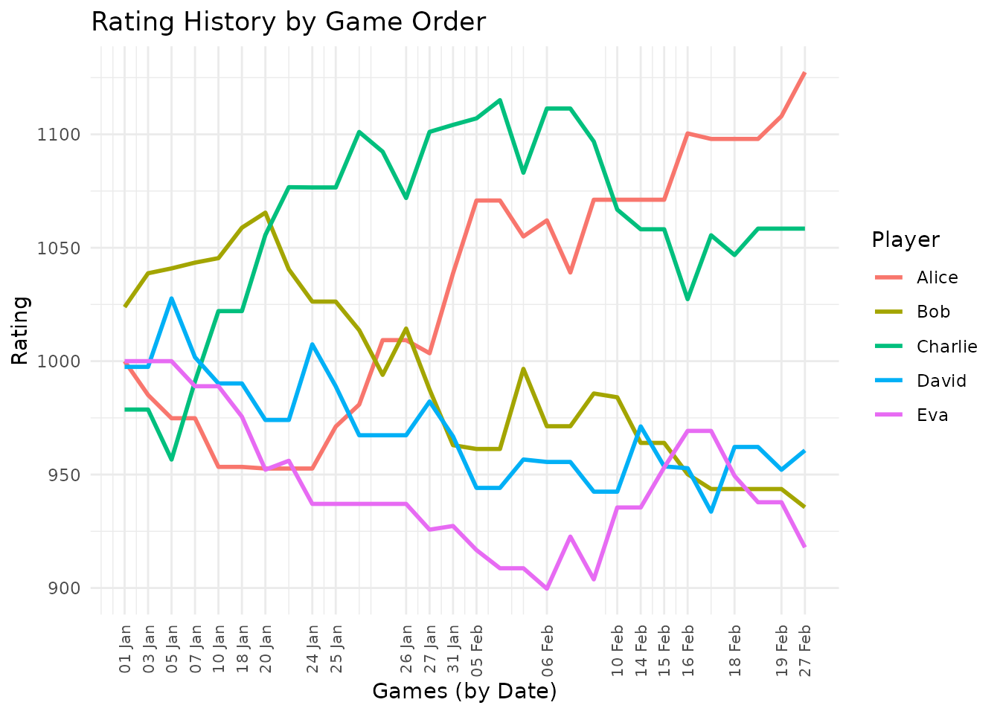

# Introduction to eloextend

``` r
library(eloextend)
library(dplyr)
library(ggplot2)
```

## Overview

The **eloextend** package extends the classic Elo rating system to
handle multiplayer games with 3 or more players. Here, we demonstrate
the key functionality - allowing you to calculate a rating system for
your own multiplayer games.

## Generating Sample Data

You’ll bring your own data, but for the purposes of demonstration let’s
make up some example data using
[`generate_toy_data()`](https://john-mulvey.github.io/eloextend/reference/generate_toy_data.md).
We’ll simulate 30 games over a 2-month period with 5 players. Key
features are the inclusion of a game_id (so that we know the order games
were played in, if more than once game was played on the same date). As
you can see, not all players participated in all games.

``` r
set.seed(42)

start_date <- as.Date("2024-01-01")
end_date <- as.Date("2024-02-29")
players <- c("Alice", "Bob", "Charlie", "David", "Eva")

game_data <- generate_toy_data(
  start_date = start_date,
  end_date = end_date,
  players = players,
  n_games = 30
)

# View first few games
head(game_data)
#>   game_id       date Alice Bob Charlie David Eva
#> 1       1 2024-01-01    NA   1       3     2  NA
#> 2       2 2024-01-03     2   1      NA    NA  NA
#> 3       3 2024-01-05     3   2       4     1  NA
#> 4       4 2024-01-07    NA   2       1     4   3
#> 5       5 2024-01-10     4   2       1     3  NA
#> 6       6 2024-01-18    NA   1      NA    NA   2
```

## Calculating Ratings, starting from nothing

The convenience function
[`calculate_all_ratings()`](https://john-mulvey.github.io/eloextend/reference/calculate_all_ratings.md)
processes an entire history of games:

``` r
ratings <- calculate_all_ratings(
  data = game_data,
  initial_rating = 1000,
  K = 32,
  method = "exponential",
  alpha = 1.4,
  D = 400
)
```

Before we begin to explore the `ratings` object produced, it is worth
noting that this is based upon
[`update_ratings()`](https://john-mulvey.github.io/eloextend/reference/update_ratings.md)
which perform the calculation for a single game’s results:

``` r
# Initial ratings (all start at 1000)
current_ratings <- c(Alice = 1000, Bob = 1000, Charlie = 1000, David = 1000)

# Game results
game_ranks <- c(Alice = 1, Bob = 2, Charlie = 3, David = NA)

# Update ratings
new_ratings <- update_ratings(
  game_ranks = game_ranks,
  current_ratings = current_ratings,
  K = 32,
  method = "exponential",
  alpha = 1.4
)

# Show changes
rating_changes <- new_ratings - current_ratings
print("Rating changes:")
#> [1] "Rating changes:"
```

The `ratings` object contains: - `final_ratings`: A named vector of each
player’s final rating after all games. - `ratings_history`: A data frame
showing how each player’s rating changed after each game, in long
format.

``` r
head(ratings$ratings_history)
#>         date  player    rating game_id
#> 1 2024-01-01   Alice 1000.0000       1
#> 2 2024-01-01     Bob 1023.8431       1
#> 3 2024-01-01 Charlie  978.6667       1
#> 4 2024-01-01   David  997.4902       1
#> 5 2024-01-01     Eva 1000.0000       1
#> 6 2024-01-03   Alice  985.0963       2
```

## Player Statistics

We can quickly calculate some basic statistics summarising the
performance of each player to date:

``` r
summarise_player_stats(game_data, ratings)
#> # A tibble: 5 × 6
#>   player  current_rating n_games n_wins n_losses win_rate
#>   <chr>            <dbl>   <int>  <int>    <int>    <dbl>
#> 1 Alice            1127.      18      8        3    0.444
#> 2 Charlie          1058.      23     10        6    0.435
#> 3 David             961.      21      4        7    0.190
#> 4 Bob               936.      23      5        6    0.217
#> 5 Eva               918.      18      3        8    0.167
```

This shows each player’s: - Current rating - Number of games played -
Number of wins - Number of losses (coming last in a game) - Win rate

## Visualising Rating History

Finally,
[`plot_rating_history()`](https://john-mulvey.github.io/eloextend/reference/plot_rating_history.md)
creates a quick way to plot how ratings changed over time. By default, a
ggplot2 object is returned.

``` r
plot_rating_history(
  ratings$ratings_history,
  title = "Rating History by Game Order",
  x_axis = "game_id",
  interactive = FALSE
)
```



Or, with an interactive plot:

``` r
# Requires plotly and htmlwidgets packages
plot_rating_history(
  ratings$ratings_history,
  title = "Interactive Rating History",
  x_axis = "game_id",
  interactive = TRUE
)
```

## Predicting Game Outcomes

Beyond general interest, a ratings system can useful because it allows
us to predict the outcome of future games.

``` r
# get the final rankings for David, Alice and Charlie
ratings_for_prediction <- ratings$final_ratings[c("David", "Alice", "Charlie")]

# Predict outcome for a game involving those three players
predictions <- predict_game_outcome(ratings_for_prediction)
print("Win probabilities:")
#> [1] "Win probabilities:"
print(sort(predictions, decreasing = TRUE))
#>     Alice   Charlie     David 
#> 0.4403813 0.3463637 0.2132551
```

``` r
sessionInfo()
#> R version 4.5.2 (2025-10-31)
#> Platform: x86_64-pc-linux-gnu
#> Running under: Ubuntu 24.04.3 LTS
#> 
#> Matrix products: default
#> BLAS:   /usr/lib/x86_64-linux-gnu/openblas-pthread/libblas.so.3 
#> LAPACK: /usr/lib/x86_64-linux-gnu/openblas-pthread/libopenblasp-r0.3.26.so;  LAPACK version 3.12.0
#> 
#> locale:
#>  [1] LC_CTYPE=C.UTF-8       LC_NUMERIC=C           LC_TIME=C.UTF-8       
#>  [4] LC_COLLATE=C.UTF-8     LC_MONETARY=C.UTF-8    LC_MESSAGES=C.UTF-8   
#>  [7] LC_PAPER=C.UTF-8       LC_NAME=C              LC_ADDRESS=C          
#> [10] LC_TELEPHONE=C         LC_MEASUREMENT=C.UTF-8 LC_IDENTIFICATION=C   
#> 
#> time zone: UTC
#> tzcode source: system (glibc)
#> 
#> attached base packages:
#> [1] stats     graphics  grDevices utils     datasets  methods   base     
#> 
#> other attached packages:
#> [1] ggplot2_4.0.2   dplyr_1.2.0     eloextend_0.1.0
#> 
#> loaded via a namespace (and not attached):
#>  [1] gtable_0.3.6       jsonlite_2.0.0     compiler_4.5.2     tidyselect_1.2.1  
#>  [5] tidyr_1.3.2        jquerylib_0.1.4    systemfonts_1.3.1  scales_1.4.0      
#>  [9] textshaping_1.0.4  yaml_2.3.12        fastmap_1.2.0      R6_2.6.1          
#> [13] labeling_0.4.3     generics_0.1.4     knitr_1.51         htmlwidgets_1.6.4 
#> [17] tibble_3.3.1       desc_1.4.3         bslib_0.10.0       pillar_1.11.1     
#> [21] RColorBrewer_1.1-3 rlang_1.1.7        utf8_1.2.6         cachem_1.1.0      
#> [25] xfun_0.56          S7_0.2.1           fs_1.6.6           sass_0.4.10       
#> [29] otel_0.2.0         cli_3.6.5          withr_3.0.2        pkgdown_2.2.0     
#> [33] magrittr_2.0.4     digest_0.6.39      grid_4.5.2         lifecycle_1.0.5   
#> [37] vctrs_0.7.1        evaluate_1.0.5     glue_1.8.0         farver_2.1.2      
#> [41] ragg_1.5.0         purrr_1.2.1        rmarkdown_2.30     tools_4.5.2       
#> [45] pkgconfig_2.0.3    htmltools_0.5.9
```
