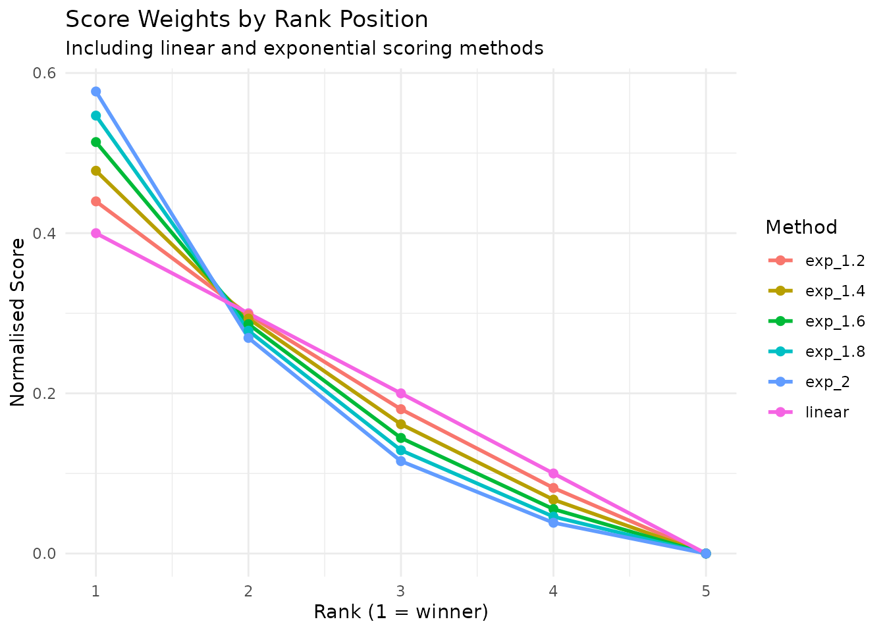

# Understanding the Rating System

``` r
library(eloextend)
library(ggplot2)
library(dplyr)
library(tidyr)
```

This vignette explains the mathematical foundations of the **eloextend**
rating system. To do this, we start by introducing the classic Elo
system and subsequently explain the modifications required to extend it
to multiplayer games.

## Classic Elo Rating System

The [Elo rating system](https://en.wikipedia.org/wiki/Elo_rating_system)
provides a method for calculating the relative skill levels of players
in two-player games. Originally dveloped for chess, it has since been
adopted in many other competitive games

### The Basic Formula

For a two-player game, player A’s rating is updated as follows:

$$R_{A}^{\text{new}} = R_{A}^{\text{old}} + K \times \left( S_{A} - E_{A} \right)$$

where:

- $R_{A}^{\text{old}}$ is player A’s current rating
- $R_{A}^{\text{new}}$ is player A’s updated rating
- $K$ is the K-factor (controls rating volatility)
- $S_{A}$ is the actual score (1 for win, 0 for loss, 0.5 for draw)
- $E_{A}$ is the expected score

### Expected Score

The expected score is calculated using a logistic function:

$$E_{A} = \frac{1}{1 + 10^{{(R_{B} - R_{A})}/D}}$$

where:

- $R_{B}$ is the opponent’s rating
- $D$ is the scale parameter (typically 400)

K and D are constants that can be adjusted to fine tune behaviour but
there are consensus values (e.g., K=32, D=400) that work well in many
scenarios.

### Zero-Sum Property

In classic Elo, if player A gains $x$ rating points, player B loses
exactly $x$ points. The total rating in the system remains constant.

## Extension to Multiplayer Games

In order to extend Elo ratings to multiplayer games, we would like to
keep some desirable mathematical properties of the Elo system:

1.  **Zero-sum property**: Rating changes in any game sum to zero
2.  **Score normalisation**: Game scores always sum to 1
3.  **Expected score consistency**: Expected scores for all players sum
    to 1

Additionally: 4. **Two-player convergence**: For n=2 players, reduces to
standard Elo

### Pairwise Matchup Approach

**eloextend** achieves this by treating a multiplayer game as the sum of
all pairwise matchups between participants.

For example, in a 3-player game where Alice finishes 1st, Bob 2nd, and
Charlie 3rd, we consider three implicit matchups: - Alice vs Bob (Alice
wins) - Alice vs Charlie (Alice wins) - Bob vs Charlie (Bob wins)

More generally, for a game with $N$ players, there are
$\left( \frac{N}{2} \right) = \frac{N(N - 1)}{2}$ pairwise matchups.

#### Expected Score in Multiplayer

For player A in an $N$-player game against opponents with ratings
$R_{1},R_{2},\ldots,R_{N - 1}$:

$$E_{A} = \frac{1}{\left( \frac{N}{2} \right)}\sum\limits_{i = 1}^{N - 1}\frac{1}{1 + 10^{{(R_{i} - R_{A})}/D}}$$

This formula sums player A’s expected win probability against each of
their $N - 1$ opponents, then normalises by the total number of pairwise
matchups $\left( \frac{N}{2} \right)$ in the game. This normalisation
ensures that expected scores across all players sum to 1.

#### Rating Update Formula

The rating update then becomes:

$$R_{A}^{\text{new}} = R_{A}^{\text{old}} + K \times (N - 1) \times \left( S_{A} - E_{A} \right)$$

The $(N - 1)$ multiplier ensures two features:

1.  **Zero-sum property**: Each player’s score $S_{A}$ is based on their
    performance against $N - 1$ opponents. The $(N - 1)$ factor scales
    the rating change to match the number of pairwise matchups each
    player participates in. When we sum the rating changes across all
    $N$ players, the total is zero, meaning the total “rating” in the
    system remains constant.

2.  **Backwards compatibility**: When $N = 2$, we have $(N - 1) = 1$, so
    the formula reduces exactly to classic Elo:
    $R_{A}^{\text{new}} = R_{A}^{\text{old}} + K \times \left( S_{A} - E_{A} \right)$.

#### Example Calculation

``` r
# 3 player game, all start at rating 1000
current_ratings <- c(Alice = 1000, Bob = 1000, Charlie = 1000)

# game results: Alice wins, Bob 2nd, Charlie 3rd
game_ranks <- c(Alice = 1, Bob = 2, Charlie = 3)
update_ratings(game_ranks, current_ratings)
#>     Alice       Bob   Charlie 
#> 1023.8431  997.4902  978.6667
```

The sum of changes is zero (within floating-point precision), confirming
the zero-sum property.

### Convergence to Classic Elo

For 2-player games, our system is mathematically equivalent to classic
Elo:

``` r
# 3 player game, all start at rating 1000
current_ratings <- c(PlayerA = 1000, PlayerB = 1000)

# game results: Alice wins, Bob 2nd, Charlie 3rd
game_ranks <- c(PlayerA = 1, PlayerB = 2)

# eloextend calculation
eloextend_ratings = update_ratings(game_ranks, current_ratings)

# Classic Elo calculation
R_A <- 1000
R_B <- 1000
E_A <- 1 / (1 + 10^((R_B - R_A) / 400))
E_B <- 1 / (1 + 10^((R_A - R_B) / 400))
S_A <- 1  # Winner
S_B <- 0  # Loser
classic_A <- R_A + 32 * (S_A - E_A)
classic_B <- R_B + 32 * (S_B - E_B)

# Compare
data.frame(
  Implementation = c("eloextend", "classic elo"),
  PlayerA = c(eloextend_ratings["PlayerA"], classic_A),
  PlayerB = c(eloextend_ratings["PlayerB"], classic_B)
)
#>         Implementation PlayerA PlayerB
#> PlayerA      eloextend    1016     984
#>            classic elo    1016     984
```

## Scoring Functions

We saw in the clasical Elo system, that games are scored as follows: -
Win = 1 - Draw = 0.5 - Loss = 0

**eloextend** offers two methods to extend this to multiplayer games:
exponential and linear. The method should be chosen to match your
intuition on how much more valuable winning is compared to placing
second, third and so on. The default is exponential scoring with
$\alpha = 1.4$, which we think is a good balance for many games.

### Exponential Scoring (Recommended)

Exponential scoring uses geometric weighting with parameter
$\alpha > 0,\alpha \neq 1$:

$$s_{i} = \frac{\alpha^{N - r_{i}} - 1}{\sum\limits_{j = 1}^{N}\left( \alpha^{N - r_{j}} - 1 \right)}$$

This gives more weight to top finishers. Higher $\alpha$ increases the
disparity between ranks, making winning more valuable than intermediate
placements.

#### The Alpha Parameter

The $\alpha$ parameter controls how much emphasis is placed on top
finishers:

- $\alpha = 1.4$ (default): Moderate emphasis on winners
- $\alpha = 2.0$: Strong emphasis on winners
- $\left. \alpha\rightarrow 1 \right.$: Approaches linear scoring
- $\left. \alpha\rightarrow\infty \right.$: Winner-takes-all (winner
  gets score 1, others get 0)

``` r
# Visualise different scoring methods
ranks <- 1:5
alphas <- c(1.2, 1.4, 1.6, 1.8, 2.0)

score_comparison <- data.frame(
  rank = ranks,
  linear = calculate_scores(ranks, method = "linear")
)

for (a in alphas) {
  score_comparison[[paste0("exp_", a)]] <- calculate_scores(ranks, method = "exponential", alpha = a)
}

score_comparison %>%
  pivot_longer(-rank, names_to = "method", values_to = "score") %>%
  ggplot(aes(x = rank, y = score, colour = method)) +
  geom_line(linewidth = 1) +
  geom_point(size = 2) +
  labs(
    title = "Score Weights by Rank Position",
    subtitle = "Including linear and exponential scoring methods",
    x = "Rank (1 = winner)",
    y = "Normalised Score",
    colour = "Method"
  ) +
  theme_minimal() +
  theme(legend.position = "right")
```



Note that for 2-player games, the exponential scoring formula simplifies
such that: - Winner receives score = 1 - Loser receives score = 0

This holds **regardless of $\alpha$**, ensuring convergence to standard
Elo.

### Handling Tied Ranks

Both scoring methods handle tied ranks by assigning equal scores to tied
players:

``` r
# Two players tied for 2nd place
ranks_with_ties <- c(Alice = 1, Bob = 2, Charlie = 2, David = 4)

linear_tied <- calculate_scores(ranks_with_ties, method = "linear")
exp_tied <- calculate_scores(ranks_with_ties, method = "exponential", alpha = 1.4)

comparison_tied <- data.frame(
  Rank = ranks_with_ties,
  Linear = round(linear_tied, 4),
  Exponential = round(exp_tied, 4)
)
print(comparison_tied)
#>         Rank Linear Exponential
#> Alice      1   0.50      0.5705
#> Bob        2   0.25      0.2148
#> Charlie    2   0.25      0.2148
#> David      4   0.00      0.0000
```

Bob and Charlie receive identical scores despite being assigned rank 2.

### Linear Scoring

Linear scoring uses arithmetic weighting based on rank position:

$$s_{i} = \frac{N - r_{i}}{\sum\limits_{j = 1}^{N}\left( N - r_{j} \right)}$$

where $r_{i}$ is player $i$’s rank (1 = best).

For a game without ties, this simplifies to:

$$s_{i} = \frac{N - r_{i}}{\left( \frac{N}{2} \right)} = \frac{2\left( N - r_{i} \right)}{N(N - 1)}$$

Linear scoring is simpler and more intuitive than exponential,
distributing scores more evenly across ranks. It’s most appropriate for
games where all finishing positions matter equally.

## Choosing Parameters

### Which Scoring Method?

**Linear Scoring:** - Simpler - Evenly distributed scores - Good for
games where all positions matter equally

**Exponential Scoring (recommended):** - Emphasises winning - More
closely matches competitive intuitions - Default $\alpha = 1.4$ provides
good balance - Tunable behaviour via $\alpha$ parameter

### Which Alpha Value?

Consider the nature of your game:

- **Low stakes, casual games** ($\alpha = 1.2$ to $1.4$): For friendly
  Mario Kart nights or casual board game groups where finishing second
  or third still matters.
- **Competitive games** ($\alpha = 1.4$ to $1.8$): For regular
  tournaments, ranked online play, or competitive board game leagues
  where winning is important but consistency across finishes matters.
- **Winner-focused games** ($\alpha = 2.0$ to $3.0$): For high-stakes
  tournaments or battle royale-style games where only winning really
  counts.

### Elo parameters (K and D)

*eloextend* mantains the traditional Elo parameters of K (development
factor) and D (scaling factor). These function in the same manner as for
the Elo rating system, and we defer to existing recommendations for
their selection.

``` r
sessionInfo()
#> R version 4.5.2 (2025-10-31)
#> Platform: x86_64-pc-linux-gnu
#> Running under: Ubuntu 24.04.3 LTS
#> 
#> Matrix products: default
#> BLAS:   /usr/lib/x86_64-linux-gnu/openblas-pthread/libblas.so.3 
#> LAPACK: /usr/lib/x86_64-linux-gnu/openblas-pthread/libopenblasp-r0.3.26.so;  LAPACK version 3.12.0
#> 
#> locale:
#>  [1] LC_CTYPE=C.UTF-8       LC_NUMERIC=C           LC_TIME=C.UTF-8       
#>  [4] LC_COLLATE=C.UTF-8     LC_MONETARY=C.UTF-8    LC_MESSAGES=C.UTF-8   
#>  [7] LC_PAPER=C.UTF-8       LC_NAME=C              LC_ADDRESS=C          
#> [10] LC_TELEPHONE=C         LC_MEASUREMENT=C.UTF-8 LC_IDENTIFICATION=C   
#> 
#> time zone: UTC
#> tzcode source: system (glibc)
#> 
#> attached base packages:
#> [1] stats     graphics  grDevices utils     datasets  methods   base     
#> 
#> other attached packages:
#> [1] tidyr_1.3.2     dplyr_1.2.0     ggplot2_4.0.2   eloextend_0.1.0
#> 
#> loaded via a namespace (and not attached):
#>  [1] gtable_0.3.6       jsonlite_2.0.0     compiler_4.5.2     tidyselect_1.2.1  
#>  [5] jquerylib_0.1.4    systemfonts_1.3.1  scales_1.4.0       textshaping_1.0.4 
#>  [9] yaml_2.3.12        fastmap_1.2.0      R6_2.6.1           labeling_0.4.3    
#> [13] generics_0.1.4     knitr_1.51         htmlwidgets_1.6.4  tibble_3.3.1      
#> [17] desc_1.4.3         bslib_0.10.0       pillar_1.11.1      RColorBrewer_1.1-3
#> [21] rlang_1.1.7        cachem_1.1.0       xfun_0.56          S7_0.2.1          
#> [25] fs_1.6.6           sass_0.4.10        otel_0.2.0         cli_3.6.5         
#> [29] withr_3.0.2        pkgdown_2.2.0      magrittr_2.0.4     digest_0.6.39     
#> [33] grid_4.5.2         lifecycle_1.0.5    vctrs_0.7.1        evaluate_1.0.5    
#> [37] glue_1.8.0         farver_2.1.2       ragg_1.5.0         purrr_1.2.1       
#> [41] rmarkdown_2.30     tools_4.5.2        pkgconfig_2.0.3    htmltools_0.5.9
```
